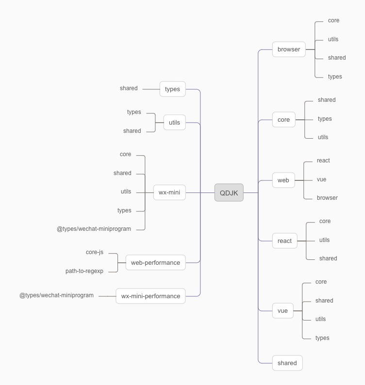

## 功能
- [x] 🔨监听请求错误
- [x] 🔨console
- [x] 🔨路由跳转
- [x] 🔨代码报错
- [x] 🔨click、wx:tab、touchmove
- [x] 🔨资源加载错误
- [x] 🏅自定义上报错误
- [x] 🚀丰富的hooks与配置项支持可高定制化
- [x] 🌝支持IE8和安卓5以上
- [x] 👌持续迭代与更新
- [x] 完善的浏览器e2e和微信小程序e2e
- [x] 完善的单元测试（77%~coding）
- [x] 支持原生Web [@supaur/qdjk-browser]
- [x] 支持Web框架（Vue3、Vue2、React@Next） [@supaur/qdjk-web]
- [x] 支持原生微信小程序、支持uni-app等微信小程序框架 [@supaur/qdjk-wx-mini]
- [x] 支持Web性能监控 [@supaur/qdjk-web-performance]
- [x] 支持微信小程序性能监控 [@supaur/qdjk-wx-mini-performance]
## 依赖关系

## 升级步骤
1. 修改的子包`(shared)`的内容以后，先进入`cd到shared子包的目录下`，在执行`yarn build`这个命令会单独打包这个子模块
2. 在发布`(shared)`npm publish
3. 主项目修改子模块版本号；yarn重新安装(最新依赖)
4. 若果需要打包所有的模块：yarn build
